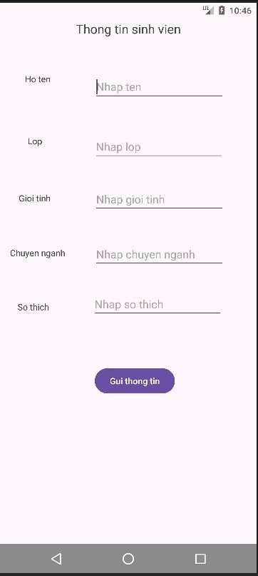
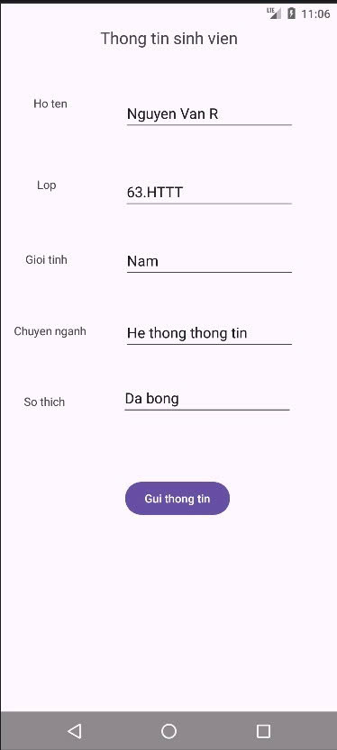
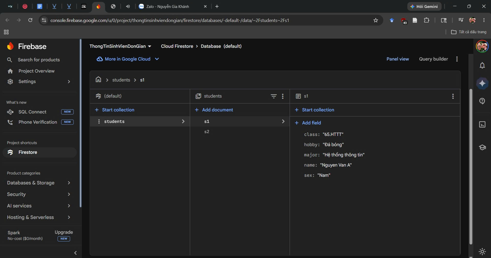
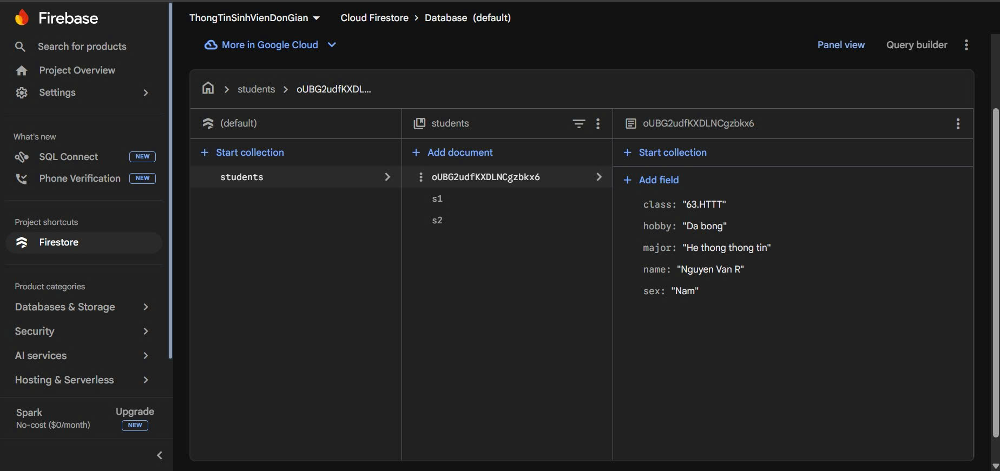

# Ứng dụng Thông tin sinh viên đơn giản kết hợp Firestrore

## Hình ảnh minh họa

Dưới đây là các bước thực hiện trong ứng dụng:

### 1. Màn hình trước khi thêm thông tin sinh viên

### 2. Màn hình sau khi thêm thông tin sinh viên

### 3. Database trước khi thêm thông tin sinh viên mới

### 4. Kết nối thành công với Database

