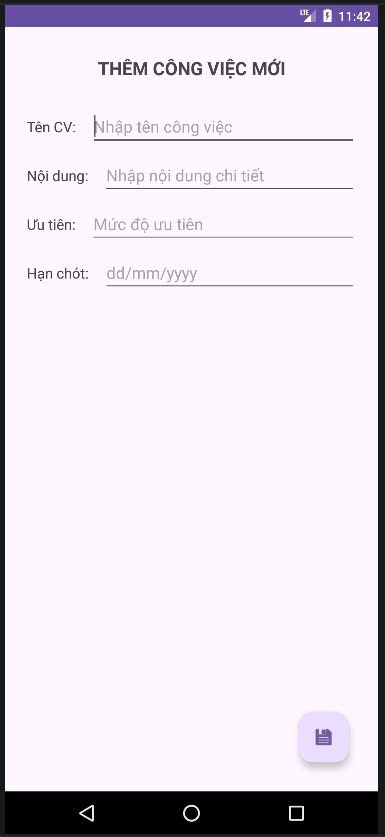
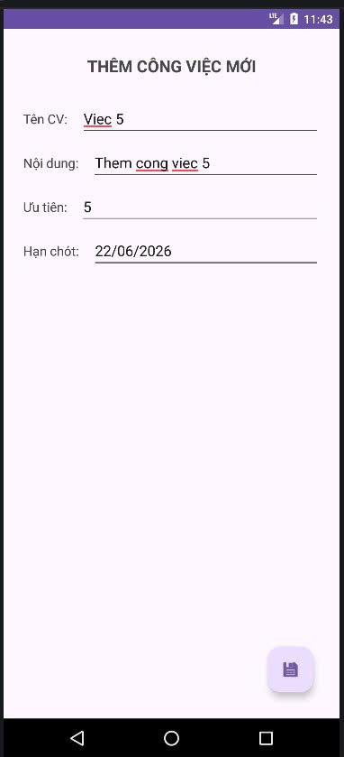
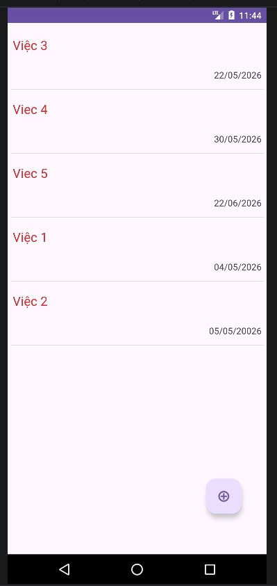
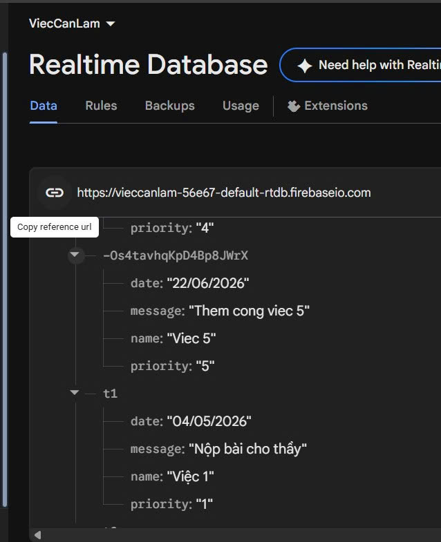

# Ứng dụng Việc Cần Làm (ViecCanLam)

Đây là ứng dụng quản lý công việc đơn giản sử dụng Firebase Realtime Database.

## Hình ảnh minh họa

Dưới đây là các bước thực hiện trong ứng dụng:

### 1. Màn hình trước khi thêm công việc

### 2. Màn hình thêm công việc mới

### 3. Nhập thông tin công việc

### 4. Thêm công việc thành công

### 5. Kết nối thành công với Database

